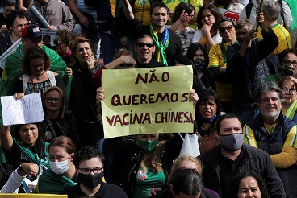
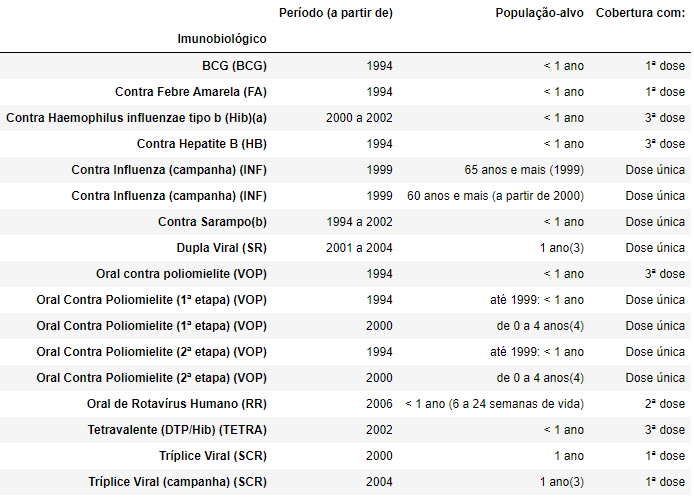

## Visão geral do projeto:

 - Objetivo do projeto
 - Introdução
    - O movimento antivacina
    - Por que o SUS é importante?
        - Programa Nacional de Imunizações (PNI)
    - Dados públicos
        - Tabnet e o DataSUS
 - Importação de bibliotecas
 - Nota técnica e Origem dos dados
 - Carregamento e Processamento dos dados
 - Levantamento de Hipóteses
 - Visualização dos dados
 - Pesquisa complementar
 - Conclusão
 - Referências
 
 ---
 
## Objetivo do projeto

O principal objetivo desse projeto é fazer uma análise da eficâcia do Programa Nacional de Imunizações (PNI) mostrando que vacinas podem sim reduzir o número de mortes relacionadas à determinadas doenças. 

Nesse projeto também será abordado conceitos sobre o negacionismo do movimento antivacina e uma proposta de solução para evitar a disseminação do maior virus da atualidade: as fake news!

---

## Introdução

---
### O movimento antivacina

Segundo um relatório da OMS, divulgado em 2019, o movimento antivacina é considerado um dos maiores problemas a saúde global. Esse movimento vai contra todo o avançado cientifico alcançado no combate as doenças letais que podem ser evitadas, ou reduzidas, com o Programa de Imunização Nacional.

  
 foto por: AMANDA PEROBELLI / REUTERS 

 

Muitas são as razões que uma pessoa pode ter para não se vacinar ou para não levarem seus filhos para a vacinação, um desses motivos é a falta ou dificuldade de acesso, em determinadas regiões sociogeográficas. Entretando, a falta de confiança nas vacinas vem crescendo devido esse movimento negacionista, que por muitas das vezes diz que ou a vacina não funciona, ou é uma forma do governo eliminar determinados grupos sociais ou até mesmo alegando que o governo irá implantar uma espécie de "chip" que irá controlar ou rastear essas pessoas, afirmações que chegam a ser ridiculas dado todo o avanço e beneficio que iremos discutir ao longo do desenvolvimento desse projeto.

---

### Por que o SUS é importante?

O SUS (Sistema Único de Saúde) dá o direito à saúde para qualquer cidadão brasileiro, oferecendo acesso integral, universal e gratuito a serviços de saúde.

Paralelamente à realização de consultas, exames e internações, o SUS também promove campanhas de vacinação e ações de prevenção de vigilância sanitária, como fiscalização de alimentos e registro de medicamentos.

  

E apesar de alguns problemas nas questões de distribuição de verba pública pelo governo, o SUS é responsável por disponibilizar, gerenciar e distribuir diversas doses de vacinas anualmente para população alvo de forma completamente gratuita. 

#### Programa Nacional de Imunizações (PNI)

O Programa Nacional de Imunizações (PNI) é uma ação do Governo Federal e que tem por objetivo eliminar, por meio da vacinação em massa da população, uma série de doenças. Como resultado, entre os casos de sucesso estão a erradicação da varíola e da poliomielite do territorio nacional.

Por meio desse programa, toda a população brasileira tem acesso às vacinas recomendadas pela Organização Mundial de Saúde (OMS).

O PNI tem como objetivos a inclusão social, ao permitir que qualquer cidadão tenha acesso às imunizações.

---

### Dados públicos

Dados públicos são dados que estão disponíveis para qualquer pessoa acessar, esses dados não tem nenhum tipo de controle ou privação de acesso.
São dados públicos, geralmente dados que toda população deve ou pode ter acesso, como por exemplo, dados que indicam os gastos de parlamentares com o dinheiro público (dinheiro que provem de impostos de forma direta ou indireta).

#### Tabnet e o DataSUS

"O aplicativo TABNET é um tabulador genérico de domínio público que permite organizar dados de forma rápida conforme a consulta que se deseja tabular. Foi desenvolvido pelo DATASUS para gerar informações das bases de dados do Sistema Único de Saúde." [http://www2.datasus.gov.br/DATASUS/APRESENTACAO/TABNET/Tutorial_tabNet_FINAL.pptx_html/html/index.html#2](http://www2.datasus.gov.br/DATASUS/APRESENTACAO/TABNET/Tutorial_tabNet_FINAL.pptx_html/html/index.html#2)

"O DATASUS disponibiliza informações que podem servir para subsidiar  análises objetivas da situação sanitária, tomadas de decisão baseadas em evidências e elaboração de programas de ações de saúde.

A mensuração do estado de saúde da população é uma tradição em saúde pública. Teve seu início com o registro sistemático de dados de mortalidade e de sobrevivência (Estatísticas Vitais - Mortalidade e Nascidos Vivos). Com os avanços no controle das doenças infecciosas (informações Epidemiológicas e Morbidade) e com a melhor compreensão do conceito de saúde e de seus determinantes populacionais, a análise da situação sanitária passou a incorporar outras dimensões do estado de saúde.

Dados de morbidade, incapacidade, acesso a serviços, qualidade da atenção, condições de vida e fatores ambientais passaram a ser métricas utilizadas na construção de Indicadores de Saúde, que se traduzem em informação relevante para a quantificação e a avaliação das informações em saúde." [http://www2.datasus.gov.br/DATASUS/index.php?area=02](http://www2.datasus.gov.br/DATASUS/index.php?area=02)
---
## Nota técnica e Origem dos dados

Os dados relacionados a cobertura vacinal nesse projeto, são oriundos do [Sistema de Avaliação do Programa de Imunizações - API](http://pni.datasus.gov.br/), sistema este gerido pela Coordenação Geral do Programa Nacional de Imunizações - CGPNI, do Departamento de Vigilância Epidemiológica, Secretaria de Vigilância em Saúde, do Ministério da Saúde, em conjunto com as Secretarias Estaduais de Saúde, suas regionais e as Secretarias Municipais de Saúde.

As Secretarias Municipais de Saúde coletam, por meio do Boletim Diário de Doses Aplicadas de Vacinas, os quantitativos de indivíduos vacinados por faixa etária em cada Estabelecimento de Saúde (salas de vacina), consolidando essas informações nos
Boletins Mensais, com registro no Sistema API em todas as instâncias.

A base de dados estadual é enviada mensalmente para a CGPNI/DEVEP/SVS/MS, quando então é consolidada a base nacional.
 Nota técnica completa em: [http://tabnet.datasus.gov.br/cgi/pni/Imun_cobertura_desde_1994.pdf](http://tabnet.datasus.gov.br/cgi/pni/Imun_cobertura_desde_1994.pdf) ou, caso o link chegue a ficar offline futuramente, ficará disponível localmente: [technical_notes/Imun_cobertura_desde_1994.pdf](technical_notes/Imun_cobertura_desde_1994.pdf)

Esses dados foram coletados no [Tabnet do PNI](http://tabnet.datasus.gov.br/cgi/tabcgi.exe?pni/cnv/cpniuf.def), aplicando os seguintes filtros:
 - Linha: Ano
 - Coluna: Unidade da Federação
 - Conteúdo: Coberturas Vacinais
 - Período disponíveis: 1994 - 2019

Com isso, foi obitido a seguinte coleção de dados (dataset) em CSV, que se encontra nesse projeto em [datasets/Cobertura_Vacinais_Ano_Unidade_Federacao_1994_2019.csv](datasets/Cobertura_Vacinais_Ano_Unidade_Federacao_1994_2019.csv)

Esses dados coletados são referentes à seguinte tabela de Imunobiológicos com determinada Cobertura:
 Descrição das variáveis disponíveis para tabulação: [http://tabnet.datasus.gov.br/cgi/pni/%5Ccpnidescr.htm](http://tabnet.datasus.gov.br/cgi/pni/%5Ccpnidescr.htm)
 
 

  

 
 Além disso, também vamos utilizar os dados relacionados aos diagnósticos de Tuberculose disponibilizados no [Tabnet do DataSUS de Tuberculose](http://tabnet.datasus.gov.br/cgi/tabcgi.exe?sinannet/cnv/tubercbr.def), aplicando os seguintes filtros:
 - Linha: Ano Diagnóstico
 - Coluna: UF de notificação
 - Conteúdo: Casos confirmados
 - Período disponíveis: 2001 - 2019

Com isso, foi obitido a seguinte coleção de dados (dataset) em CSV, que se encontra nesse projeto em [datasets/Tuberculose_Ano_UF_Confirmados.csv](datasets/Tuberculose_Ano_UF_Confirmados.csv)
 ---
 ## Visualização dos dados
 
 ---
 ## Levantamento de Hipóteses
 
 ---
 ## Pesquisa complementar
 
 ---
 ## Conclusão
 
 ---
 ## Referências
